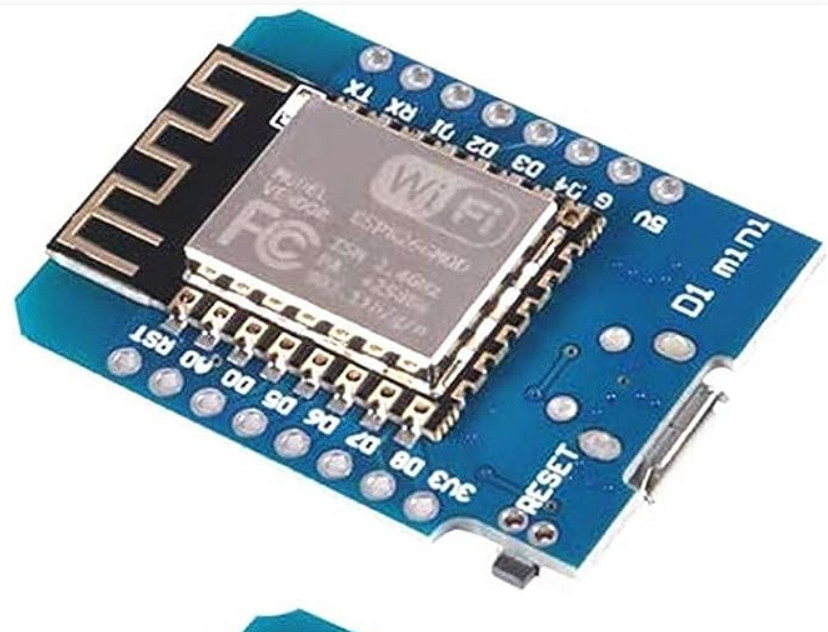

# Flexible TPU SlimeVR Case

# Description

This is a SlimeVR case that's designed to flex in 3 places, and be thin and form fitting for comfort.

This is 3D printed in TPU using an FDM printer.
Below is a full assembly guide.

All Fusion 360 files and STL files are included. CAD files include STLs of the components as well as wires. The wire lengths can be derived from the CAD as well. See below.

The AUX Extension case is based on Hyperion's AUX (https://github.com/Smeltie/Hyperion), but modified to better fit straps and to fit the Slime BNO085. A different AUX case could be used if desired.

# Components
All of these are from the slimevr components page - https://docs.slimevr.dev/diy/components-guide.html.

See BOM section for purchase links.

* SlimeBNO085 from the store
* NodeMCU Wemos D1 Mini v3 USB-C
    * has diagonal corners, not holes at the edges.
* SS22F32 DPDT switch
* 40mm wide bicycle straps
* TP4056 USB-C charger
* 804040 Lipo battery
* 180K resistors
* 1N5817 diodes
* Aux wires
    * can use the JST 5-pin connectors or other, up to you
* Chest tracker can be any tracker (including this one) that could be worn in a chest harness.
* 26 gauge wire

# CAD Images

# Assembly

## Preparation
Determine how many trackers you need, and how many aux extensions.
This will determine how many AUX extension cases and AUX-hole covers you need to print.

* How many needed? https://docs.slimevr.dev/slimevr101.html#how-many-trackers-do-you-need
* Extension Locations - https://docs.slimevr.dev/slimevr101.html#what-is-an-extension
* Placement - https://docs.slimevr.dev/server/putting-on-trackers.html#recommended-tracker-placement 
* Mounting Points - https://docs.slimevr.dev/server/putting-on-trackers.html#recommended-mounting-points
* see below for strap setups

## BOM (Parts list)
* TPU 3D Printing filament
    * GeeTech 95A TPU - https://a.co/d/7t7FijG
    * Other TPU will work, softer TPU will probably work just fine.
* PLA 3D Printing filament (or other non-flex plastic) - for soldering frame and for AUX cases
* Slime BNO85
    * https://shop.slimevr.dev/products/slimevr-imu-module-bno085
* NodeMCU Wemos D1 Mini USB-C
    * https://a.co/d/j2Xz2Xc 
    * has 2 diagonal corners at the edge opposite the USB C port, not holes.
    * 
* TP4056 USB C Charger - https://a.co/d/4RcbUQ2
* 804040 lipo batteries
    * this may take the longest to ship
    * https://www.aliexpress.us/item/3256802373289352.html?gatewayAdapt=glo2usa4itemAdapt 
* SS22F32 DPDT Switch - https://a.co/d/aXBrVRG
* Diodes 1N5817 - https://a.co/d/6bufUdn
* Resistors 180K - https://a.co/d/ePpOxc7
* AUX wires JST 5 pin connectors - https://a.co/d/irJMjlQ
    * other wires will work. The cases do not require these particular connectors, but the wires should not be thicker than the above model (26 gauge roughly).
* Straps
    * 1.5 x 13.8 inches stretchable hook & loop bicycle straps - https://a.co/d/cQ9oqGq
    * buy at least 4 more for the shorts below.
    * Thigh trackers generally need 2 each for a larger person. Waist needs 3. One each for feet/ankles/elbows/arms.
    * In total, I ordered 3 packs of 6 for a 6 tracker+2 extension system
* Wire - 26 gauge - https://a.co/d/1BhiWA9 
    * thicker than this could cause fit problems

### Other
* soldering shrink tubing
### Optional/Recommended
* chest harness
    * 
    * https://a.co/d/c24gWyE
    * Generally a harness is the best way to hold a chest tracker
    * others could work better depending on whether this is for a tracker or aux
    * designed for a phone, could fit this tracker or another. might not work so well with aux on a wire.
* 1 to 6 USB-C charging cable - https://a.co/d/jfV2l9w
    * convenient for charging. Be sure to plug into a high amp charger (2A)

## 3D Printing
The AUX extension cases and the soldering frame are printed out of normal PLA or other non-flex plastic.
The main tracker bodies are printed from TPU flexible plastic.

Printing TPU can go wrong, use the below guide to calibrate your printer for the filament. Also note that TPU will absorb moisture over time, so old filament may not print well.

Here's a great video on tuning for TPU. You calibrate for temperature, retraction speed, and retraction length mainly.

https://www.youtube.com/watch?v=lD9Ei3u5-iU

## Assembling
1. Wire lengths can be measured and cut in advance. See the below files. The names of the wires come from the CAD file, but hopefully theyre clear without opening that.
    * [txt/wires.txt](txt/wires.txt)
    * [txt/wires-aux.txt](txt/wires-aux.txt)

1. Tin all wires. If there are loose strands they may definitely cause a short, and soldering the connections will be much more difficult. This may especially be a risk when using the soldering frame. \
\
Here's a good video on soldering from the SlimeVR website: https://youtu.be/P0YX_eKyfxA

### About the soldering frame
This may significantly reduce soldering time per tracker. For my skill level (probably low), this reduced assembly time from 4 hours to 2 hours per tracker.

Below: All wires placed and ready for modules (I didnt do the 2 battery connection ones)

* The idea is to mount all wires in the frame, and place the modules over the wires and through the holes, and then solder each connection.
* This frame may be only good for 2 uses, so may want to print multiple. This version may have some overly thin things that can melt a little from soldering heat.
* Might be a little frustrating to insert the wires, might need to make a wire or a little two longer
* may need to push wires upwards to ensure they are flush with each module. If they slip down this can be corrected afterwards.

#### Usage
* Solder the ground wires to the switch separately.
* The frame has 2 parallel round holes (and holes for the 3 connecting wires) to lay the diodes in, and another for soldering the resistor (with wire holes too).
* It has spaces for the 3 modules.
* Wires should be attached underneath (including the switch wires, assembled diodes and resistor-containing wires).
* Upon finishing, rotate each the module and pass it through the square hole underneath, passing it to the bottom.
* Remove the assembled tracker electronics!

### Soldering assembly steps
Consult the schematic (below are current as of 2/17/2024)
#### Base

#### Aux

#### First steps
* NOTE! Battery connections come last!

1. On the SlimeBNO, bridge the spot on the non-aux IMU with a soldering iron.
1. For an aux tracker, make the 4 wires that are 3 little wires joined together.
1. Solder the 3 ground wires to the switch
    * for aux, one will be the tri-split ground wire
1. Assemble the diodes and shrinktube them.
1. Assemble the resistor-containing wire and shrinktube

#### If using the soldering frame
1. Mount all wire connections in the frame underneath.
1. Place all modules over the wires and through the holes
1. Push the wires up as much as possible so the insulation is flush with the module, and arent showing exposing wire
    * You can re-solder connections that slipped down after to correct this. 
1. Solder each connection

#### Manual soldering steps
1. TP4056 ground connection to switch first
1. Ground connections from switch to the IMU and D1
    * for aux, use the tri-split ground wire for the IMU
1. 5V Power connection to the D1, then the 3V3 to the IMU
    * for aux, use the tri-split wire for the 3V3 IMU
1. Do the SDA, SDL, INT connections from the D1 to IMU(s)
    * for aux, use the tri-split wires
1. For aux only
    * measure the needed aux wire lengths according to where it will be used on your body
    * connect the 5-pin JST plug to the 5 wires (INT, SDA, SCL, 3V3, GND)

#### AUX extension case assembly
* Solder the aux wires to the IMU
* Insert into the case and close the cover.
  * May need to use a plastic tool to push the IMU into the slot inside the case. Don't push it in too tight as it may get damaged.
* May need to tie a rubber band around it to keep the the cover on.

#### Battery
Solder the battery connections in now and test to see if it turns on.

### Final Assembly
The parts should be tucked into the cover in the little pockets. 
To help things slip in, pull outwards from the edge of the case to help parts go in.
1. For the aux tracker only, make a cut from the edge to the square hole in the side of one of the wire channels (next to the switch and D1). (I forgot this in the design).
1. Tuck the D1 into its pocket, USB port first
    * Beware of the reset button. Make sure to not catch this on the edge of the case when inserting it. It could be damaged and ripped off.
1. Insert the TP4056 into its pocket, USB port first
1. Except for the DPDT switch, insert the other parts and the wires into their pockets/channels. Make the aux connector come out of the hole.

Now its time to cover things up.
1. Insert the switch into its holder in the back cover first.
1. Remove unecessary parts of the back cover with scissors:
    * Cut the 2 D1 holder posts off where they have a slit.
    * Cut the holder post off of the TP4056 part of the cover.
    * These get in the way of assembly and don't help. They will be removed in later designs. The port hole and back cover is sufficient to hold these parts.
1. Push/Tuck the back into the cover, working from one end to the other.
    * The switch should be fairly easy to hook in and install.
    * You can pull from the edges of the cover to help slip the back cover in. Fingernails help.
    * Be careful with the battery, but that part is honestly very easy to assemble.

## Wearing
Insert the straps into the trackers.
You can get extra length by putting the buckle in one side and passing the strap through it.

For the waist and thigh trackers, I recommend making "shorts" out of straps to prevent thigh slip-down. Thigh trackers should be worn on the sides with this setup, but this could probably be adapted for other mounting orientations.

For each thigh tracker, get 2 additional straps. For each strap, pass the strap into its own buckle on one end, making a loop. Use the hook-and-loop end to attach the 2 straps to either side of the thigh tracker. Pass the waist tracker through the 2 loops.
It should make "shorts" that you can pull on. The thigh trackers should be worn on the side, and the waist in the back or front.

Ankles and foot trackers should be worn as pictured.

# Calibration Tips
## Mounting calibration
A very common issue is that the "skiing pose" is easy to get wrong. Your feet should be straight (not angled), causing your legs to be turned somewhat inwards (towards eachother).

# Contributing

I'm definitely open to edits via pull requests.
For the CAD files, I recommend making modifications on top of the existing designs. It may be tricky to go back and make historical edits in the design. Many of the edits I made were additive.

# License

* MIT License https://opensource.org/license/mit/
* Hyperion also is MIT License - https://github.com/Smeltie/Hyperion, see [LICENSE_Hyperion](./LICENSE_Hyperion) 